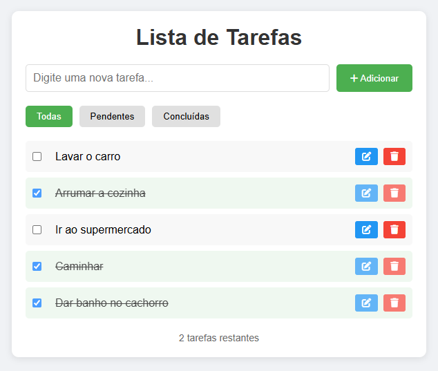

# Gerenciador de Tarefas

Este projeto é um gerenciador de tarefas simples, onde os usuários podem adicionar, editar, excluir e marcar tarefas como concluídas. Além disso, permite filtrar as tarefas entre "Todas", "Pendentes" e "Concluídas".

## Demonstração



## 🚀 Funcionalidades

- Adicionar novas tarefas ✅
- Editar tarefas existentes ✏️
- Marcar tarefas como concluídas ✅
- Remover tarefas ❌
- Filtragem por estado (Todas, Pendentes, Concluídas) 🔍
- Contador de tarefas pendentes 📊
- Armazenamento no **localStorage** para persistência dos dados 💾

## 🛠️ Tecnologias Utilizadas

- **HTML**: Estrutura da aplicação.
- **CSS**: Estilização básica.
- **JavaScript (Vanilla JS)**: Lógica da aplicação.
- **LocalStorage**: Persistência dos dados.

## 📌 Como Usar

### 1️⃣ Clonar o repositório
```bash
   git clone https://github.com/mikelj917/Lista-de-Tarefas.git
```

### 2️⃣ Abrir o arquivo `index.html`
Apenas abra o arquivo `index.html` em um navegador.

## 📜 Estrutura do Código

### 📝 `script.js`
- **`renderTasks(filter)`** → Atualiza a exibição das tarefas com base no filtro.
- **`saveTask()`** → Salva as tarefas no localStorage.
- **`countTasks()`** → Exibe a contagem de tarefas pendentes.
- **Eventos**:
  - Adicionar tarefas ao clicar no botão.
  - Editar tarefas ao clicar no botão de edição.
  - Marcar como concluída ao clicar na checkbox.
  - Remover tarefas ao clicar no botão de deletar.
  - Filtrar as tarefas clicando nos botões de filtro.

### 🖥️ `index.html`
- Contém a estrutura básica da aplicação, incluindo:
  - Input para adicionar tarefas.
  - Lista de tarefas dinâmicas.
  - Botões de filtro (Todas, Pendentes, Concluídas).
  - Contador de tarefas pendentes.

### 🎨 `style.css`
- Estilos básicos para melhorar a aparência da aplicação.

## 🎯 Melhorias Futuras

- ✅ Adicionar suporte para **arrastar e soltar** (drag and drop)
- ✅ Implementar **modo escuro** (dark mode)
- ✅ Melhorar animações e feedback visual

## 📜 Licença
Este projeto está sob a licença MIT. Sinta-se livre para usar e modificar! 😉

