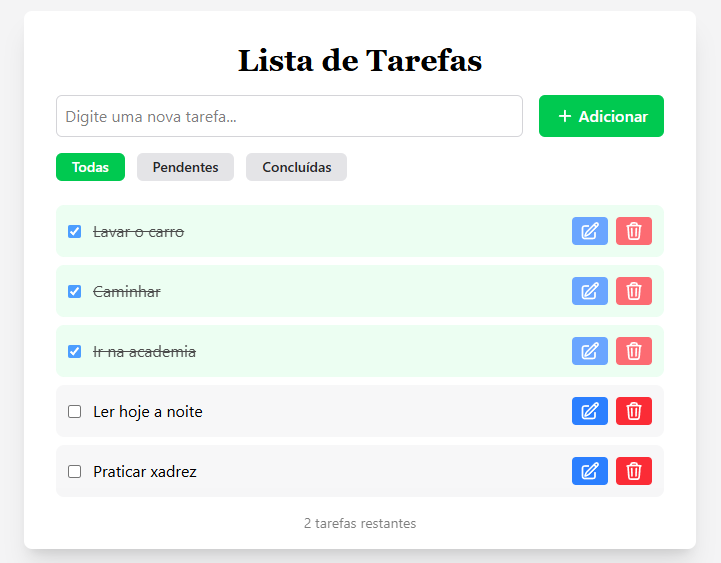
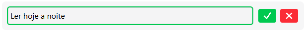

# Lista de Tarefas

Uma aplicação simples e funcional para gerenciamento de tarefas, construída com HTML, JavaScript e estilizada com Tailwind CSS.

## 📸 Demonstração

## 🚀 Funcionalidades

- **Adicionar tarefas**  
  Insira uma nova tarefa facilmente usando o campo de texto e o botão **Adicionar**.

- **Filtrar tarefas**  
  Visualize **todas as tarefas**, apenas as **pendentes** ou apenas as **concluídas** através dos filtros na parte superior.

- **Marcar como concluída**  
  Clique na checkbox ao lado da tarefa para marcá-la como concluída ou pendente.

- **Editar tarefas com controle total**  
  Ao clicar no botão de edição de uma tarefa, o texto da tarefa se transforma em um campo de texto editável e aparecem dois novos botões:  
  - **Confirmar**: salva a alteração feita na tarefa  
  - **Cancelar**: descarta a edição e volta ao texto original
  
  
  Essa abordagem garante que você possa revisar e confirmar as alterações antes de atualizar a lista, evitando erros acidentais.

- **Excluir tarefas**  
  Remova qualquer tarefa da lista com apenas um clique no botão de exclusão.

- **Persistência local**  
  Todas as tarefas são salvas no `localStorage` do navegador, permitindo que permaneçam disponíveis mesmo após fechar ou atualizar a página.

## 🛠️ Tecnologias Utilizadas

- **HTML** e **TypeScript**
- **Tailwind CSS** para estilização rápida.
- **LocalStorage** para a persistência de dados no navegador.

## 📜 Licença
Este projeto está sob a licença MIT. Sinta-se livre para usar e modificar!

